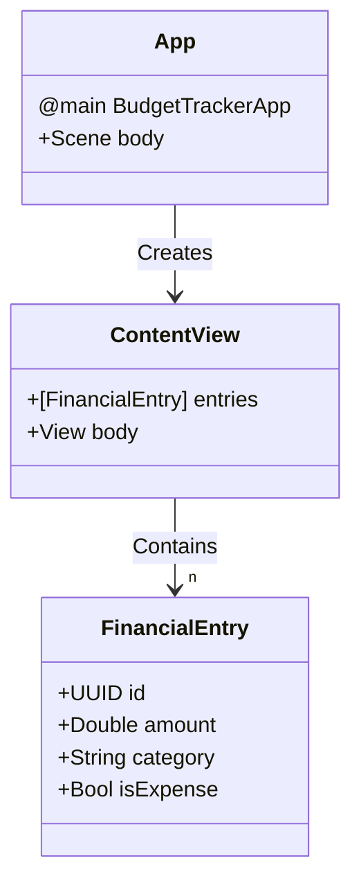

Analysis of the Kodeco BudgetTrackerApp.swift file

- - - -

Tutor: Anthropic's AI Claude

- - - -

Claude's high-level overview of the data flow and structure of the SwiftUI BudgetTrackerApp.swift file

Explanation of structure and data flow:

1. Entry Point:
   - The app starts with the `@main` attribute on `BudgetTrackerApp`, making it the entry point
   - `BudgetTrackerApp` conforms to the `App` protocol

2. View Hierarchy:
   - `BudgetTrackerApp` creates a `WindowGroup` scene
   - The scene instantiates `ContentView` as its root view

3. Data Model:
   - `FinancialEntry` is the core data model
   - It's a struct that conforms to `Identifiable`
   - Contains properties for tracking financial transactions:
     - `id`: Unique identifier
     - `amount`: Transaction value
     - `category`: Transaction category
     - `isExpense`: Boolean flag for expense vs. income

4. Data Flow:
   - `ContentView` holds an array of hardcoded `FinancialEntry` instances
   - Currently renders an `EmptyView`
   - Could be expanded to display the entries in various UI components

Currently, the data flow is quite simple since the view isn't rendering anything, but the structure is set up to support a full-featured budget tracking application. 
