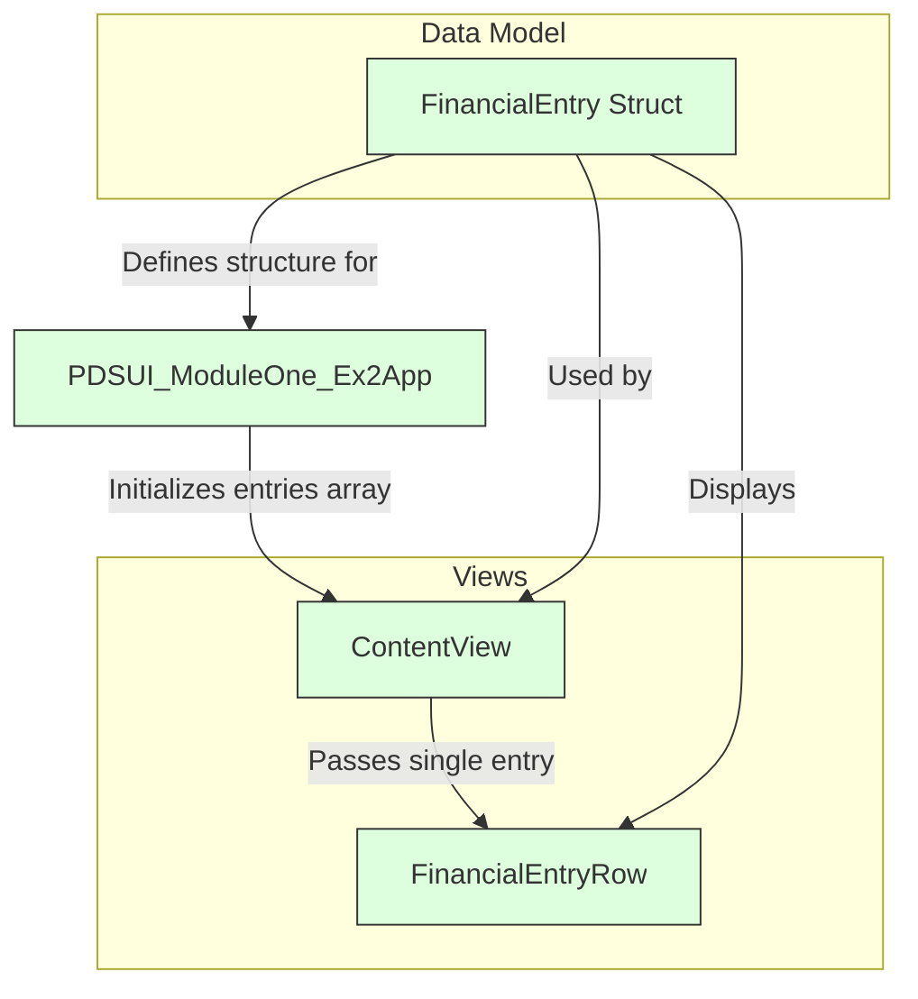

 A more maintainable app structure

- - - -

Tutor: Anthropic's AI Claude

- - - -

Claude's high-level overview of how data flows through this SwiftUI budget tracking app, focusing on how a FinancialEntry like "Income: 3000" moves through the system.





Here's how the data flows through the application:

1. **Data Definition** (FinancialEntry.swift):
   - The `FinancialEntry` struct defines the data model with properties for amount, category, and transaction type
   - Each entry has a unique ID through conformance to `Identifiable`

2. **Data Initialization** (PDSUI_ModuleOne_Ex2App.swift):
   - The app's main entry point creates an array of `FinancialEntry` instances
   - Your example entry (Income: 3000) is initialized here as:
     ```swift
     FinancialEntry(amount: 3000, category: "Income", isExpense: false)
     ```

3. **Data Flow to Main View** (ContentView.swift):
   - The entries array is passed to `ContentView` through its initializer
   - ContentView receives the entire array but doesn't modify it (marked as `let`)
   - The array is used to generate the list structure

4. **Individual Entry Display** (FinancialEntryRow.swift):
   - Each entry is passed individually to a `FinancialEntryRow` view
   - The row view receives a single entry and displays its properties
   - For your Income entry, it would:
     - Show "Income" text (based on `isExpense: false`)
     - Display "$3000.00" in green (since it's not an expense)

This is a one-directional data flow pattern, where data is passed down through the view hierarchy. The app uses immutable data (`let` properties) which means the financial entries can't be modified after creation, ensuring data consistency throughout the view hierarchy.

- - - -

Claude's high level overview of how ContentView.swift interacts with each file in the app


 ```mermaid
flowchart TD
    A[PDSUI_ModuleOne_Ex2App.swift] --> B[ContentView.swift]
    C[FinancialEntry.swift] --> B
    B --> D[FinancialEntryRow.swift]
    
    subgraph Main View Container
    B
    end
    
    style A fill:#dfd,stroke:#333
    style B fill:#dfd,stroke:#333
    style C fill:#dfd,stroke:#333
    style D fill:#dfd,stroke:#333
```


1. **Interaction with PDSUI_ModuleOne_Ex2App.swift**:
   - The app file serves as the entry point and configuration center
   - It initializes the sample entries array
   - Injects this array into ContentView through its initializer: `ContentView(entries: entries)`
   - Sets up ContentView as the root view of the application

2. **Interaction with FinancialEntry.swift**:
   - ContentView relies on the FinancialEntry struct as its primary data model
   - The entries array in ContentView is typed as `[FinancialEntry]`
   - ContentView uses FinancialEntry's Identifiable conformance for its ForEach loop
   - The data structure defined in FinancialEntry determines what information ContentView can display

3. **Interaction with FinancialEntryRow.swift**:
   - ContentView creates FinancialEntryRow instances for each entry in its list
   - Passes individual FinancialEntry instances to each row: `FinancialEntryRow(entry: entry)`
   - Manages the layout and organization of these rows within its List and Section structure

This makes ContentView the central hub of the application because it:
- Receives the data from the app's entry point
- Uses the data model structure
- Manages the creation and organization of row views
- Provides the navigation structure
- Handles the main UI layout and organization


